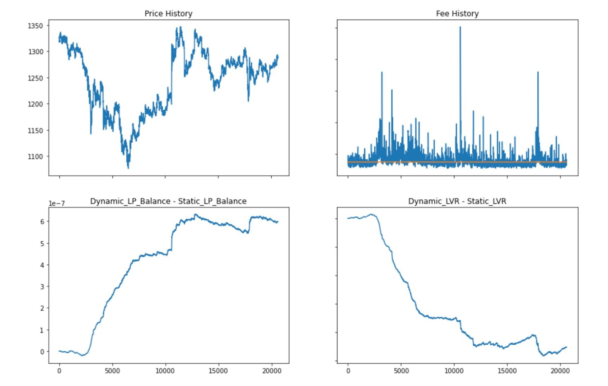

# Smartswap

## Table of Contents
- [Problem Statement](#problem-statement)
- [Solution](#solution)
- [Unique Features](#unique-features)
- [Getting Started](#getting-started)
- [Images of Our Product](#here-are-some-images-of-our-product)
- [YouTube Video](#link-to-our-youtube-video)

## Problem Statement
In the evolving landscape of decentralized finance (DeFi), traditional liquidity pools often struggle with issues like fluctuating transaction fees and inefficiencies in capital utilization. This can lead to reduced profitability for liquidity providers and a suboptimal trading experience for users.

## Solution
Smartswap addresses these challenges by leveraging a dynamic fee management system that adjusts fees based on market volatility. By integrating the **Volatility Oracle**, Smartswap provides real-time data to optimize transaction costs, ensuring that liquidity providers are compensated fairly and users benefit from reduced slippage during trades.

## Unique Features
- **Dynamic Fee Structure**: Unlike traditional DEXs, Smartswap adjusts fees based on volatility, ensuring that users only pay for what they need.
- **On-Chain ML/AI Inference**: Utilizes smart contracts for direct integration with machine learning models, allowing for accurate volatility predictions and fee adjustments.
- **Cross-Chain Compatibility**: Leveraging Chainlink's CCIP for seamless communication across different blockchain networks, enhancing liquidity and user access.

## Getting Started
To run the Smartswap project locally, follow these steps:

1. **Clone the Repository**:
   ```bash
   git clone <repository-url>
   cd smartswap
    ```
2. **Install Dependencies**:
   ```bash
    npm install
    ```

3. **Update Config**:
   Add the contract addresses that we have deployed. And also add thirdweb client ID in env file
 <br>

4. **Start the dev Server**
    ```bash
    npm run dev
    ```
### Here are some of the images of our Product 
 


 

 

## Link to our Youtube Video

<iframe width="560" height="315" src="https://www.youtube.com/embed/zAW74HyFiac?si=1dafK-L6BRqXVuBO" title="YouTube video player" frameborder="0" allow="accelerometer; autoplay; clipboard-write; encrypted-media; gyroscope; picture-in-picture; web-share" referrerpolicy="strict-origin-when-cross-origin" allowfullscreen></iframe>
